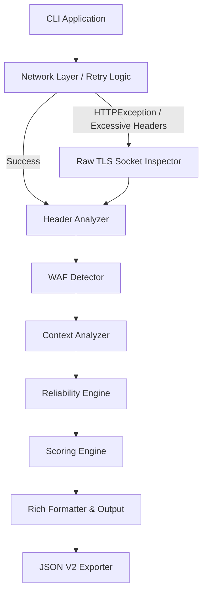

# GuardCLI


Professional Security Header & Infrastructure Assessment Framework.

GuardCLI is a defensive cybersecurity CLI tool that audits HTTP security posture. It analyzes security headers, detects infrastructure misconfigurations, identifies WAFs, and calculates a holistic security score with high precision.

---

## Key Capabilities

- **Security Header Analysis**: Deep evaluation of HSTS, CSP, X-Frame-Options, Referrer-Policy, and Permissions-Policy.
- **Reliability Framework**: Confidence-based evaluation and scoring suppression during unreliable scan conditions.
- **Fallback Inspection**: Raw TLS socket execution to extract telemetry when standard HTTP clients crash (e.g., recursive header injection attacks).
- **WAF Detection**: Automatically identifies common Web Application Firewalls (Cloudflare, Akamai, AWS WAF, Imperva, Sucuri).
- **Dynamic Help & Dashboards**: Built-in introspection for real-time feature discovery.
- **JSON Export (V2)**: Comprehensive programmatic output of raw data, diagnostics, limits, and normalized security findings.

---

## Architecture Overview



---

## Installation

### Prerequisites
- Python 3.11+
- Pip/Hatchling

### Local Setup
```bash
git clone https://github.com/Dyx4e-Dev/guard-cli.git
cd guard-cli
pip install .
```

### Development Setup
```bash
pip install -e .[dev]
```

---

## Usage & Command Reference

### `guard scan`
Scan a target URL for security headers and infrastructure configurations.

**Syntax**:
```bash
guard scan <URL> [OPTIONS]
```

**Options**:
- `--timeout`: Global connection timeout in seconds (Default: `10`).
- `-k`, `--insecure`: Disable SSL certificate verification.
- `--json`: Path to export comprehensive JSON report (V2 schema).
- `--json-v1`: Path to export legacy JSON report (V1 schema).
- `-ua`, `--user-agent`: Custom User-Agent string.
- `-v`, `--verbose`: Enable verbose logging.
- `-d`, `--debug`: Enable debug output for root cause analysis and redirect tracing.
- `--audit`: Enable internal audit mode to print raw and normalized headers along with calculated penalties.

**Examples**:
```bash
guard scan https://example.com
guard scan https://example.com --audit
guard scan https://example.com --debug
guard scan https://example.com --json report.json
guard scan https://example.com -k -v
```

### `guard doctor`
Run internal system diagnostics to ensure the local GuardCLI installation is healthy.

**Example**:
```bash
guard doctor
```

### Dynamic Help
To view the dynamically generated feature dashboard:
```bash
guard --help
guard -v
```

---

## Scan Modes & Reliability Framework

GuardCLI tracks its own context to guarantee the accuracy of its findings. The engine utilizes three **Reliability Modes**:

1. **RELIABLE**: Represents a standard `FULL_SCAN`. The server responded cleanly with an HTTP 2xx or 3xx. Scores and grades are generated.
2. **PARTIAL**: Represents a `PARTIAL_SCAN`. The server responded with a 401 or 403, indicating that some endpoints are hidden behind auth. Scores are partially calculated but reliability drops.
3. **UNRELIABLE**: Represents a `FALLBACK_INSPECTION` or `TIMEOUT_RECOVERY`. The scanner could not parse the response naturally and had to intervene. Security scores and grades are **suppressed** (N/A) to prevent false confidence.

### Finding Confidence
Each individual finding is tagged with a confidence rating:
- **VERIFIED**: The configuration was definitively parsed and evaluated.
- **ESTIMATED / HEURISTIC**: The finding was extrapolated (often occurs during Fallback Inspection scenarios).

---

## Fallback Inspection Engine

Standard HTTP clients (like `requests` and `http.client`) enforce strict limits on HTTP headers (e.g., maximum of 100 headers) to prevent Denial of Service (DoS) attacks. However, broken WAF configurations or malicious CDN stacking can routinely violate these limits.

When this occurs, standard scanners crash. **GuardCLI engages the Fallback Inspection Engine**. 

1. An `ExcessiveHeadersError` is caught.
2. GuardCLI opens a **Raw TLS Socket** connection directly to the host.
3. GuardCLI streams only the first 16KB of the response to manually extract the status line, the first 50 headers, and header duplicate counts.
4. Security analysis is performed on the extracted telemetry, and WAF detection is run.
5. The scan reliability drops to **UNRELIABLE** and the overall security score is suppressed, but the user is provided with critical diagnostics on why the infrastructure is failing.

---

## Security Scoring

GuardCLI employs a deduplicated penalty-weight scoring system starting at `100/100`.

### Severity Matrix:
- **CRITICAL**: -20 points (e.g., Missing HTTPS, Unmitigated 'unsafe-inline' in CSP)
- **MEDIUM**: -10 points (e.g., Weak HSTS max-age, Invalid X-Content-Type-Options)
- **LOW**: -5 points (e.g., Missing Permissions-Policy)
- **INFO**: 0 points (e.g., Server Header Information Disclosure)

### Grading:
- **A**: 90 - 100
- **B**: 70 - 89
- **C**: 50 - 69
- **D**: 30 - 49
- **F**: < 30

*Note: Scores are completely suppressed if `analysis_reliability` drops to UNRELIABLE.*

---

## Output Formats

### JSON Reporting (V2)
GuardCLI V2 introduces a heavily structured reporting schema designed for SIEM and automation ingestion.

```json
{
  "meta": {
    "scanner_name": "GuardCLI",
    "version": "0.1.1",
    "scan_duration_ms": 142,
    "report_version": "2.0",
    "scan_timestamp": "2026-06-24T18:00:00+00:00"
  },
  "target": {
    "url": "https://example.com",
    "status_code": 200,
    "waf_detected": "CLOUDFLARE",
    "scan_context": "FULL_SCAN",
    "analysis_confidence": "HIGH",
    "analysis_reliability": "RELIABLE",
    "scan_integrity": "COMPLETE",
    "analysis_mode": "NORMAL_SCAN"
  },
  "results": {
    "summary": { "score": 90, "grade": "A", "total_findings": 8 },
    "headers": [ ... ],
    "diagnostics": null
  }
}
```

---

## Project Structure

```text
guard-cli/
├── pyproject.toml
├── README.md
├── src/
│   └── guardcli/
│       ├── __init__.py
│       ├── cli.py               # Typer CLI Entrypoints
│       ├── dashboard.py         # Dynamic Discovery & Dashboards
│       ├── exceptions.py        # Custom Application Errors
│       ├── formatter.py         # Rich Rendering & JSON Export
│       ├── headers.py           # Security Header Analysis
│       ├── main.py              
│       ├── raw_inspect.py       # Fallback TLS Socket Inspector
│       ├── retry.py             # Redirection & Resilience Layer
│       ├── schemas.py           # V2 Data Models
│       ├── scoring.py           # Penalty Weight Engine
│       └── waf_detector.py      # WAF Signatures & Context
└── tests/
    ├── test_cli.py
    ├── test_dashboard.py
    ├── test_headers.py
    ├── test_raw_inspect.py
    └── test_scoring.py
```

---

## Testing

GuardCLI enforces robust testing paradigms including mocked network paths, exception bubbling, and AST parsing checks.

```bash
pytest tests/ -v --cov=src/guardcli
```

---

## Contributing

1. Fork the repository
2. Create your feature branch (`git checkout -b feature/amazing-feature`)
3. Commit your changes (`git commit -m 'Add some amazing feature'`)
4. Ensure all tests and dynamic health checks pass (`guard doctor`)
5. Push to the branch (`git push origin feature/amazing-feature`)
6. Open a Pull Request

## License

This project is open-source software. (License UNKNOWN).
